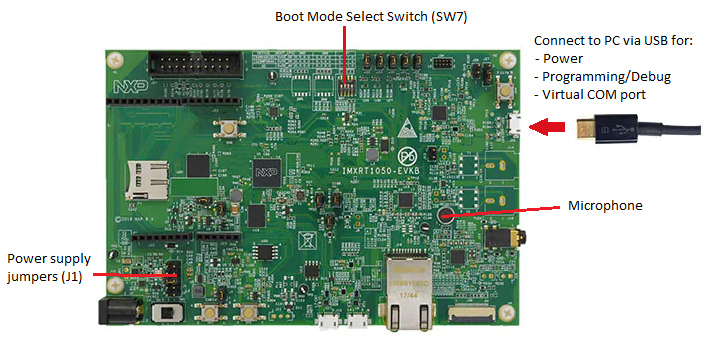

# Micro speech example for TensorFlow Lite

The program analyzes an audio input with a voice recognition model that can detect 2 keywords - **yes** and **no**. The recognized keywords are then printed into a serial interface. The voice recognition model is implemented using [TensorFlow Lite for Microcontrollers](https://www.tensorflow.org/lite/microcontrollers). 

The example project can be executed on Arm Fixed Virtual Platform (FVP) as well as on hardware targets.

## Structure

The repository is organized as follows:

Folder                                                | Description
:-----------------------------------------------------|:--------------------
`./micro_speech/`                                       | Contains the voice recognition model that is used by all targets. This part is similar to the original TF-Lite for Microcontrollers example, with just minor modifications.<br>TensorFlow calculation kernel is provided separately via corresponding software packs listed in Prerequisites.
`./Platform_FVP_Corstone_SSE-300_Ethos-U55/`            | Project files specific for Corstone SSE-300 FVP target.
`./Platform_IMXRT1050-EVKB/`                            | Project files specific for IMXRT1050-EVKB target.
`./Platform_MIMXRT1064-EVK/`                            | Project files specific for MIMXRT1064-EVK target.
`./VSI/`                                                | Implementation of Audio Streaming Interface for FVP targets with [**Virtual Streaming Interface (VSI)**](https://arm-software.github.io/VHT/main/simulation/html/group__arm__vsi.html).

## Prerequisites

**Toolchain**
- IDE (Windows only): [Keil Microcontroller Development Kit (MDK)](https://developer.arm.com/tools-and-software/embedded/keil-mdk)
- alternatively, [CMSIS-Build](https://github.com/ARM-software/CMSIS_5/releases/download/5.7.0/cbuild_install.0.10.2.sh) command-line building tools that are part of the [CMSIS_5 release](https://github.com/ARM-software/CMSIS_5/releases)

**Specific for FVP targets**
- for targets with VSI support
  - [Python 3.9](https://www.python.org/downloads/)
  - [Fast Models](https://developer.arm.com/tools-and-software/simulation-models/fast-models) 11.16
  - FVP model for Corstone-300 MPS3 with VSI support
- for targets without VSI support
  - [Ecosystem FVP for Corstone-300 MPS3](https://developer.arm.com/tools-and-software/open-source-software/arm-platforms-software/arm-ecosystem-fvps

**Specific for HW targets**
- [NXP MIMXRT1050-EVKB](https://www.nxp.com/design/development-boards/i-mx-evaluation-and-development-boards/mimxrt1064-evk-i-mx-rt1064-evaluation-kit:MIMXRT1064-EVK) board, or
- [NXP MIMXRT1064-EVK](https://www.nxp.com/design/development-boards/i-mx-evaluation-and-development-boards/mimxrt1064-evk-i-mx-rt1064-evaluation-kit:MIMXRT1064-EVK) board

Note that CMSIS software packs used in the specific project will be requested and installed automatically when using Keil MDK or CMSIS-Build.

## Micro speech for FVP (Fixed Virtual Platform) for Corstone SSE-300 with Ethos-U55

Project directory: `./Platform_FVP_Corstone_SSE-300_Ethos-U55/`

This project implements micro-speech example for Corstone SSE-300 with Ethos-U55 Fixed Virtual Platforms (FVPs).

Example project has the following targets:
 - `Example`: target runs on FVP **with [**Virtual Streaming Interface (VSI)**](https://arm-software.github.io/VHT/main/simulation/html/group__arm__vsi.html)**
    - Uses special Corstone SSE-300 Ethos-U55 FVP with VSI support)<br>
      It is required to install the model executable and binaries in order to run this example.<br/>
      Expected installation directory on Windows: `C:\Program Files\Arm\VHT\models\Win64_VC2019`<br/>
      If installed in a different directory then this needs to be reflected:
       - in uVision project (Options for Target - Debug - Settings for Models Armv8-M Debugger) when running with MDK or
       - in script `run_example.cmd` when running standalone
    - Audio test data is provided by Python script `./VSI/audio/python/arm_vsi0.py` from WAVE file `test.wav` which contains keywords 'Yes' and 'No' alternating three times.
    - Open the example with Keil MDK (Windows only) using the uVision project `microspeech.uvprojx` and build it for target `Example`.
    - Alternatively compile with CMSIS-Build using `microspeech.Example.cprj` project.
    - Run example from the uVision project or standalone with script `run_example.cmd`.
    - When running the example the audio data input is processed and detected keywords are output to the Telnet terminal with their time stamps in the audio stream. Following output can be observed for the default test.wav file included with the example:
      ```
      Heard yes (152) @1100ms
      Heard no (141) @5500ms
      Heard yes (147) @9100ms
      Heard no (148) @13600ms
      Heard yes (147) @17100ms
      Heard no (148) @21600ms
      ```
 - `Example Test`: internal test for Example target
 - `Audio Provider Mock`: runs on FVP **without VSI support**
    - Uses [**ecosystem FVP for Corstone-300 MPS3**](https://developer.arm.com/tools-and-software/open-source-software/arm-platforms-software/arm-ecosystem-fvps).<br>
      Expected installation directory on Windows `c:\Program Files\ARM\FVP_Corstone_SSE-300_Ethos-U55\models\Win64_VC2017\FVP_Corstone_SSE-300_Ethos-U55.exe`<br>
	     If installed in a different directory then this needs to be reflected:
        - in uVision project (Options for Target - Debug - Settings for Models Armv8-M Debugger) when running with MDK or
        - in script run_example.cmd when running standalone
	   - Audio test data is embedded in the test code and contains keywords 'Yes' and 'No' alternating indefinitely.
    - Open the example with Keil MDK (Windows only) using the uVision project `microspeech.uvprojx` and build it for target `Audio Provider Mock`.
    - Alternatively compile with CMSIS-Build using `microspeech.Audio_Provider_Mock.cprj` project.
    - Run example from Keil MDK, or standalone with script `run_audio_provider_mock.cmd`.
    - When running the example the audio data input is processed and detected keywords are continuously output to the Telnet terminal with their time stamps in the audio stream. Following output can be observed for the default test.wav file included with the example:
      ```
      Heard silence (149) @400ms
      Heard yes (158) @1200ms
      Heard no (143) @5600ms
      Heard yes (149) @9100ms
      Heard no (142) @13600ms
      Heard yes (149) @17100ms
      Heard no (142) @21600ms
      ```
 - `Audio Provider Mock Test`: internal test for Audio Provider Mock target

## Micro speech for IMXRT1050-EVKB board

Project directory: `./Platform_IMXRT1050-EVKB/`

This example executes the program on [NXP IMXRT1050-EVKB](https://www.nxp.com/design/development-boards/i-mx-evaluation-and-development-boards/i-mx-rt1050-evaluation-kit:MIMXRT1050-EVK) development board with an Arm Cortex-M7 processor. It uses the on-board microphone for audio input and prints recognized keywords to the serial interface. 
One target **IMXRT1050-EVK** is provided in the project.

The board shall be connected to a PC via USB port J28. Jumper J1 shall connect pins 5-6 to ensure correct power supply in such setup. The project is configured to load the program to on-board Hyper Flash so the boot switch SW7 shall be set to 0110.



Execute the program in following steps:
 - Build example with MDK using uVision project `microspeech.uvprojx` or CMSIS-Build using `microspeech.IMXRT1050-EVKB.cprj` project.
 - Program and run the example with MDK or use Drag-and-drop programming through the DAP-Link drive.
 - Open the DAP-Link Virtual COM port in a terminal (baudrate = 115200) and monitor recognized keywords.

## Micro speech for MIMXRT1064-EVK board

Project directory: `./Platform_MIMXRT1064-EVK/`

This example executes the program on [NXP MIMXRT10504-EVK](https://www.nxp.com/design/development-boards/i-mx-evaluation-and-development-boards/mimxrt1064-evk-i-mx-rt1064-evaluation-kit:MIMXRT1064-EVK) development board with an Arm Cortex-M7 processor. It uses the on-board microphone for audio input and prints recognized keywords to the serial interface. One target **MIMXRT1064-EVK** is provided in the project.

The board shall be connected to a PC via USB port J41. Jumper J1 shall connect the pins 5-6 to ensure correct power supply in such setup. The project is configured to load the program to on-board QSPI NOR flash so the boot switch SW7 shall be set to 0010.


Execute the program in following steps:
 - Build example with MDK using uVision project `microspeech.uvprojx` or CMSIS-Build using `microspeech.MIMXRT1064-EVK.cprj` project.
 - Program and run the example with MDK or use Drag-and-drop programming through the DAP-Link drive.
 - Open the DAP-Link Virtual COM port in a terminal (baudrate = 115200) and monitor recognized keywords.
